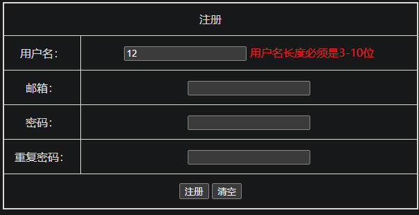
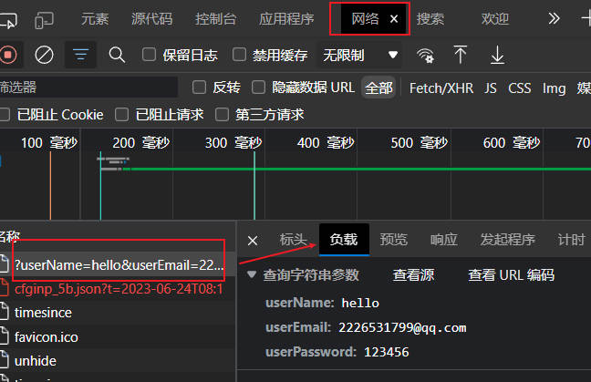

# 第四章_表单校验案例
### 表单校验 使用到的事件
* #### `onsubmit()`      提交时
    + `onsubmit()` 表单提交时 return 取返回值 true 才会提交
* #### `onblur()`        失去焦点时

## 环境准备：
### 1. 网页结构代码
``` html
<!-- CSS -->
<style>
    table {
        width: 600px;
        height: 300px;
        border: 2px solid;
        border-collapse: collapse;
    }
    tr,
    td {
        border: 1px solid;
        text-align: center;
    }
</style>
<!-- html 这里事先添加好事件了 -->
<form method="get" action="http://127.0.0.1:3000/" onsubmit="return checkForm()">
    <table>
        <tr>
            <td colspan="2">注册</td>
        </tr>
        <tr>
            <td>用户名：</td>
            <td>
                <input name="userName" type="text" id="user-name"  onblur="checkUserName(this)">
                <span color="red" id="uM-name"></span>
            </td>
        </tr>
        <tr>
            <td>邮箱：</td>
            <td a>
                <input name="userEmail" type="text" id="email" onblur="checkEmail(this)">
                <span color="red" id="uM-email"></span>
            </td>
        </tr>
        <tr>
            <td>密码：</td>
            <td>
                <input name="userPassword" type="text" id="password" onblur="checkPassword(this)">
                <span color="red" id="uM-password"></span>
            </td>
        </tr>
        <tr>
            <td>重复密码：</td>
            <td>
                <input type="text" id="repeat-password" onblur="checkPassword(this)">
                <span color="red" id="uM-repPassword"></span>
            </td>
        </tr>
        <tr>
            <td colspan="2">
                <input type="submit" value="注册">
                <input type="reset" value="清空">
            </td>
        </tr>
    </table>
</form>
```
### 2. 表单提交地址：`（URL 是 from 的 action 属性值、提交的 method 是 get）`
#### `菜鸟教程`提供的地址：`https://www.runoob.com/try/demo_source/demo-form.php`
#### 使用 nodejs 写的 🍳 http 服务：`http://127.0.0.1:3000/`
1. 新建 server.js 文件，代码内容如下：
2. 需要安装（已安装跳过） __[node](https://nodejs.cn/download/) 环境__ （默认安装）
3. 启动服务，控制台命令 `node server.js` （如果没有就把 node 添加到系统环境变量 的 `path` 里）然后就可以直接访问了
``` js
// 引入 http 模块
const http = require("http")
// 创建服务
const server = http.createServer((request, response) =>
{
    response.setHeader("Content-Type", "text/html;charset=UTF-8")
    response.end("<h1>注册成功</h1>")
})
// 启动服务，断开监听
server.listen(3000, () =>
{
    console.log("服务 3000 启动...");
    console.log("访问地址：http://127.0.0.1:3000/");
})
```
---

## 案例开始
### 1. 定义函数 `checkForm()` 提交时校验
- from 添加属性：`onsubmit="return checkForm()"`，这里使用函数的返回值
- 通过id (`getElementById`) 拿到：`名称`、`邮箱`、`密码` 、`重复密码` 消息框
``` js
// 提交时校验
function checkForm()
{
    var isPass = true; // 是否通过提交
    // 用户提示框        
    var userMassageName = document.getElementById("uM-name");
    var userMassageEmail = document.getElementById("uM-email");
    var userMassagePassword = document.getElementB("uM-password");
    var massageRepPassword = document.getElementB("uM-repPassword");

    // todo
    /**
     *  用户名检测
     *  邮箱检测
     *  密码校验
     */

    return isPass;
}
```
---
### 2. `checkForm()` 函数添加 `用户名检测` 功能
- 拿到用户名：`getElementById("user-name")`
- 判断用户名的长度必须为：3 ~ 10
``` js
var userName = document.getElementById("user-name");      // 获取用户名元素
var length = userName.value.length;     // 获取字符串长度
if (length < 3 || length > 10)
{
    isPass = false;
    userMassageName.innerText = "用户名长度必须是3-10位";   // 用户提示
    return isPass;
}
else
{
    userMassageName.innerText = ""; // 清空提示框信息
}
```
---
### 3. `checkForm()` 函数添加 `邮箱检测` 功能
- 邮箱正则表达式，提供网站: https://c.runoob.com/front-end/854/
``` js
var userEmail = document.getElementById("email").value; //  获取邮箱
var emailReg = /^\w+([-+.]\w+)*@\w+([-.]\w+)*\.\w+([-.]\w+)*$/; // 邮箱判断正则
if (!emailReg.test(userEmail))
{
    isPass = false;
    userMassageEmail.innerText = "邮箱格式不正确!";
    return isPass;
}
else
{
    userMassageEmail.innerText = "";
}
```
---

### 4. `checkForm()` 函数添加 `密码校验` 功能
- 检测密码长度：6 ~ 10
- 检测两次密码是否一致
``` js
// 密码、重复密码元素获取
var userPassword = document.getElementById("password").value;
var repeatPassword = document.getElementById("repeat-password").value;
if (userPassword.length < 6 || userPassword.length > 10)
{
    isPass = false;
    userMassagePassword.innerText = "密码长度为6-10";
    return isPass;
}
else if (repeatPassword != userPassword)
{
    isPass = false;
    userMassagePassword.innerText = "";
    massageRepPassword.innerText = "两次密码不一致！";
    return isPass;
}
else
{
    massageRepPassword.innerText = "";
}
```
---
### 5. 用户输入完成后校验（`名称、邮箱、密码`）(简单封装一下)
#### 检查用户名
- 添加新的方法 `checkUserName(userName)`、形参：用户名输入框
- 用户名的 `input` 框绑定事件：`onblur="checkUserName(this)"`
- 这里传入的 `this` 就是表示这个 `input` 元素
``` js
 // 检查用户名
function checkUserName(userName)
{
    var userMassageName = document.getElementById("uM-name");
    var length = userName.value.length;
    if (length < 3 || length > 10)
    {
        // 用户提示
        userMassageName.innerText = "用户名长度必须是3-10位"
        return false;
    }
    else
    {
        userMassageName.innerText = "";
        return true
    }
}
```
---
#### 检测邮箱
- 添加新的方法 `checkEmail(userEmail)`、形参：邮箱输入框
- 邮箱的 `input` 框绑定事件：`onblur="checkEmail(this)"`
``` js
 //检查邮箱
function checkEmail(userEmail)
{
    var userMassageEmail = document.getElementById("uM-email");
    var emailReg = /^\w+([-+.]\w+)*@\w+([-.]\w+)*\.\w+([-.]\w+)*$/;
    if (!emailReg.test(userEmail.value))
    {
        // 用户提示
        userMassageEmail.innerText = "邮箱格式不正确!";
        return false;
    }
    else
    {
        userMassageEmail.innerText = "";
        return true
    }
}
```
---

#### 密码检测、重复密码
- 添加新的方法 `checkPassword()`、
- 形参：不需要、因为需要再两个地方用，所以在函数内部获取就行了
- 密码、重复密码的 `input` 框绑定事件：`onblur="checkPassword()"`
``` js
// 检查密码
function checkPassword()
{
    // 消息框
    var userMassagePassword = document.getElementById("uM-password");
    var massageRepPassword = document.getElementById("uM-repPassword");

    // 密码元素
    var userPassword = document.getElementById("password").value;
    var repeatPassword = document.getElementById("repeat-password").value;

    if (userPassword.length < 6 || userPassword.length > 10)
    {
        // 用户提示
        userMassagePassword.innerText = "密码长度为6-10";
        return false;
    }
    else if (repeatPassword != userPassword)
    {
        // 用户提示
        userMassagePassword.innerText = "";
        massageRepPassword.innerText = "两次密码不一致！";
        return false;
    }
    else
    {
        massageRepPassword.innerText = "";
        return true
    }
}
```
---

### 6. 修改 `checkForm()` 函数
- 获取到 `名称` 和 `密码`
- 调用上面的三个函数，只需要把 `名称` 和 `密码` 传入即可
``` js
 // 提交时校验
function checkForm()
{
    var userName = document.getElementById("user-name");
    var userEmail = document.getElementById("email");

    // 用户名检测
    if (!checkUserName(userName)) return false;
    // 邮箱检测
    if (!checkEmail(userEmail)) return false;
    // 密码校验
    if (!checkPassword()) return false;

    return true;
}
```
---
### 页面效果图



---

### 查看提交的内容
`F12` 打开控制台 -> 网络选项卡，找到提交的那一条（默认是第一条），-> `负载` 里就是提交的数据了



---