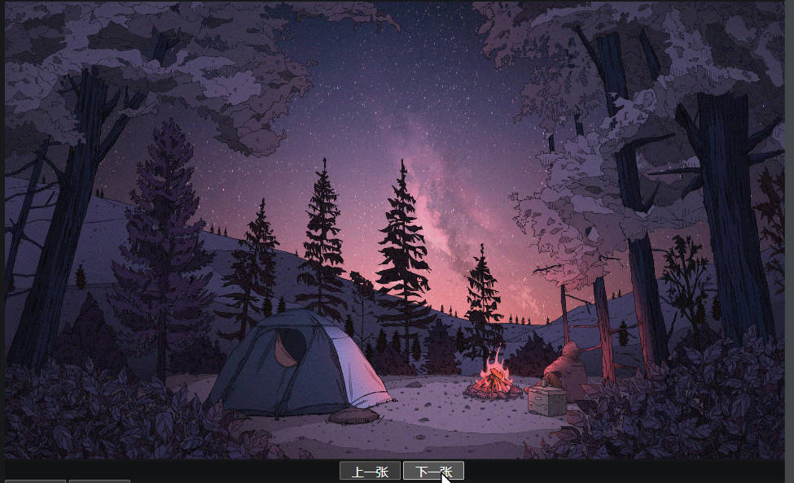

# 第六章_图片轮播和弹窗广告
### __1. 数组__
#### 创建一个空的数组
- `new Array(a , b , c ...)` 使用数组构造函数
- `= [a , b , c ...]` 使用 [] 表示数组
- 访问数组内部的元素通下标索引 `[0]`
- 通过 `length` 属性可以获取数组里元素的个数
``` js
// 空的数组
var arr1 = new Array();
var arr2 = []
// get
arr1[0] = 10;
arr1[1] = 20;
console.log(arr1.length);
```
---

#### 数组里的数据是可变的（包括数据类型）
``` js
var arr1 = new Array();
// set
arr1[0] = 10;
arr1[1] = 20;
arr1[2] = "Hello";
arr1[3] = "World";
```
---
#### 基本遍历数组 `for`
``` js
var arr1 = new Array();
arr1[0] = 10;
arr1[1] = 20;
arr1[2] = "Hello";
arr1[3] = "World";
for (var i = 0; i < arr1.length; i++) {
    console.log(arr1[i]);
}
```
---
#### 指定数组长度，不定义数值 (undefined)
- 此时访问数组里的元素，返回的就是 `undefined`
``` js
var arr2 = new Array(10);
// undefined x 10
for (var i = 0; i < arr2.length; i++) {
    console.log(arr2[i]);
}
```
---

#### 设置初始值、赋值
``` js
var arr3 = new Array(10, 20, 30, 46, 45, 123, 134, 900, "钟离");
// 或
var arr = [10, 20, 30, 46, 45, 123, 134, 900, "钟离"]
for (let i = 0; i < arr3.length; i++) {
    const element = arr3[i];
    console.log(element);
}
```

--- 
#### 存储对象
- 数组里的元素存储的，数据类型是对象 {} `object`
- js 数组是可以保存，多种类型的数组的
``` js
// 构造函数
function user(name, age, element) {
    this.name = name;
    this.age = age;
    this.element = element;
    this.showInfo = showInfo;
    function showInfo() {
        console.log("name: " + name);
        console.log("age: " + age);
        console.log("element: " + element);
    }
}
// 保存对象、字符串到数组里
var userArr = new Array(new user("钟离", 2000, "岩元素"), new user("胡桃", 19, "火元素"), "离月港");
// 访问数组里的元素、调用方法
userArr[0].showInfo();
userArr[1].showInfo();
console.log(userArr[2]);
```

---

### __2. 弹窗和关闭案例__
#### html 结构
- `onload` 事件，加载完成时
``` html
<style>
    #ad {
      width: 320px;
      height: 180px;
      position: fixed;
      bottom: 40px;
      right: 10px;
      display: none;
    }
    div>button {
        margin-left: 270px;
        margin-top: 5px;
    }
    h1 {
        font-size: 100px;
        text-align: center;
    }
</style>
<body onload="myInit()">
    <h1>弹窗在右下角</h1>
    <div id="ad">
        <div>
            <!-- 绑定点击事件 -->
            <button onclick="closeAdvert()">关闭</button>
            <a href="https://ys.mihoyo.com/" title="《原神》官方网站-全新3.5版本「风花的呼吸」上线！">
                
            </a>
        </div>
    </div>
</body>
```
---

#### js 代码
- `myInit()` 页面加载完成时调用
- `showAdvert()` 显示弹窗方法
- `closeAdvert()` 关闭弹窗方法
- 原理：设置 `display` css 属性 `none` 、 `block`
- `setTimeout( 回调函数 , 时间)` 定时器，时间单位毫秒、指定时间调用回调函数
``` js
function myInit()
{
    window.setTimeout(showAdvert, 2000);
}
function showAdvert()
{
    var adForm = document.getElementById("ad");
    adForm.style.display = "block";
}
function closeAdvert()
{
    var adForm = document.getElementById("ad");
    adForm.style.display = "none";
    // 关了又弹
    window.setTimeout(showAdvert, 1000);
}
```
- 效果


---

### __3. 图片轮播案例__
#### html 结构
``` html
<!-- CSS -->
<style>
    div {
        margin: 0 auto;
        width: 1300px;
        background-color: #00000021;
    }

    div img {
        width: 1300px;
        height: 750px;
    }

    button {
        width: 100px;
        height: 30px;
        font-size: 20px;
    }
</style>
<body onload="myInit()">
    <div>
        
        <div align="center">
            <button onclick="preImage()" onmouseover="changState(false);" onmouseout="changState(true);">上一张</button>
            <button onclick="nextImage()" onmouseover="changState(false);" onmouseout="changState(true);">下一张</button>
        </div>
    </div>
</body>
```
---
#### 1. 初始化数据
- `myInit()` 页面加载完毕调用的函数
- `setInterval` 循环定时器，启动自动切换下一张
---
- 使用 `index` 的值作为图片路径数组的下标
- 修改 `index` 实现图片的切换
- `changState(state)` 修改状态方法 ( true / false)
- `上一张、下一张按钮` 鼠标进入时添加 `onmouseover` 事件绑定 `changState(false)`
- `上一张、下一张按钮` 鼠标离开时添加 `onmouseout` 事件绑定 `changState(true)`
- 防止在手动切换图片时，跟自动切换冲突
``` js
// 页面加载完成时，调用自动切换方法（修改图片的路径）
function myInit() {var myTimer = window.setInterval(changImage, 5000);}
// 图片路径数组
var imagPaths = new Array(
    "../img/wallhaven-exo2gr.jpg",
    "../img/werw-v.jpg",
    "..//img/nilucaoshen.jpg",
    "../img/wanye.jpg",
    "../img/xaiogon.jpg",
    "../img/晚上.jpg"
);
var isChang = true;     // 是否自动切换
var index = 0;      // 图片路径索引
// 修改状态
function changState(state)
{
    isChang = state;
}
```
---

- `changImage()` 自动切换下一张
- 直接调用下一张的函数即可 `nextImage()`
``` js
function changImage()
{
    if (isChang)
    {
        nextImage();
    }
}
```

---

- `preImage()` 上一张
- 上一张按钮的添加 `onclick` 绑定此事件
- 当 `index == 0` 时，将 `index` 设置成数组的 `length` 长度。`index--` 放在判断后面
``` js
function preImage()
{
    if (index == 0)
    {
        index = imagPaths.length;
    }
    var myImg = document.getElementById("my-img");
    index --;
    myImg.src = imagPaths[index];
}
```

- `nextImage` 下一张
- 下一张按钮添加 `onclick` 绑定此事件
- 当 `index > 数组的长度 - 1 `时，让 `index = 0`。`index++` 放在判断前面
``` js
function nextImage()
{
    var myImg = document.getElementById("my-img");
    index ++;
    if (index > imagPaths.length - 1)
    {
        index = 0;
    }
    myImg.src = imagPaths[index];
}
```
---
#### 效果图


---



---