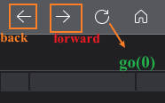

# 第七章_JavaScript Window

> `window` 代表整个网页窗口，内容、 `BOM`

> `document` 代表整个网页文档，位于窗口里的元素、也是属于 window 里面成员 、`DOM`

### __1. 具有变量提升 `var` 声明的变量__
- 都是属于全局的 `window` 对象里的（变量提升）
- 使用 `window.` 也能访问到，也可省略前面的 `window` 直接访问
``` js
var name = "hello";
console.log(window.name);
console.log(name);
```
---

### __2. `window` 属性、方法__
#### `window.alert( 消息 )` 页面弹出一个信息框（会阻止进程的运行）
``` js
window.alert("in window alert");
```
---

#### `window.confirm( 消息 )` 弹出确认框，（会阻止进程的运行）
- 返回一个`布尔`值,确定返回 true、取消返回 false
``` js
console.log(window.confirm("确定要退出此页面吗?"));
```

---

#### `window.prompt( 消息 )` 弹出输入框 （会阻止进程的运行）
- 返回输入的内容，取消输入返回 `null` 
``` js
console.log(window.prompt("请输入内容"));
```
---

### __3. 通过 `window` 创建新的窗口__
#### `open` 方法，打开新窗口
- `open( 打开的地址url，窗口名称， 指定窗口的高宽 )`返回值一个 `窗口实例对象`
``` js
var WinObj = window.open("https://www.bilibili.com/", "new_Window", "width=500px,height=500px");
```
#### `resizeTo( x , y )` 设置窗口大小
``` js
WinObj.resizeTo(1000, 1000);
```
#### `moveTo( x , y )` 移动窗口在屏幕的位置坐标
``` js
WinObj.moveTo(1000, 500);
```
#### `close()` 关闭窗口
``` js
WinObj.close();
```
#### `focus()` 窗口焦点
``` js
WinObj.focus();
```
---

### __4. `screen` 和  `location` 对象、属性__
#### `screen` 对象 
- 页面相关操作、获取`网页的页面`分辨率等信息
``` js
// 高a vailHeight 属性，可用分辨率高度  (网页的页面的分辨率)
console.log(window.screen.availHeight);
// 宽 availWidth 属性，可用分辨率宽度    (网页的页面的分辨率)
console.log(window.screen.availWidth);
```
---

#### `location` 对象 
- 获取当前页面的网址、等信息
- `protocol` 获取协议
- `hostname` 主机域名
- `port`  获取地址栏端口号，（果网址使用的是默认的端口号，返回的是空字符串）
- `pathname` 网页的完整路径，中文显示16进制（去除协议域名端口的）
``` js
// protocol     获取协议
console.log(location.protocol);

// hostname     主机域名
console.log(window.location.hostname);

// port         获取地址栏端口号
console.log(location.port);

// pathname     网页的完整路径   中文显示16进制
console.log(location.pathname);

// 直接打印对象，会显示出里面所有的键值对
console.log(location);
```
---

#### 重新指定网址 ` location.assign( url )`
- 会将从当前的页面，切换成重新指向的网址页面
``` js
location.assign("https://www.bilibili.com/")
```

---
### __5. `history` 对象__
#### `forward()` 方法，前进
- 相当于游览器的 `前进按钮`，前进的历史记录列表，往下移动一条（跳转）
``` js
history.forward();
```
---

#### `back()` 方法，后退
- 相当于游览器的 `后退按钮`，后退的历史记录列表，往下移动一（跳转）
``` js
history.back();
```
---

#### `go(n)` 方法、移动多条记录
- `n = 3` ，表示直接前进 3 条历史记录 （正数前进）
- `n = -3` ，表示直接后退 3 条历史记录 （负数后退）
- `n = 0` ，刷新当前页面 （零刷新）
- 如果超出当前的历史记录条数，就会不做跳转
``` js
history.go(3);
history.go(-3);
history.go(0);
```
### 游览器按钮图



---