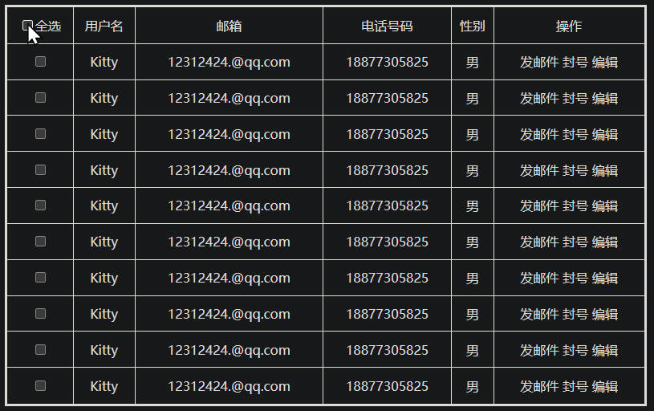
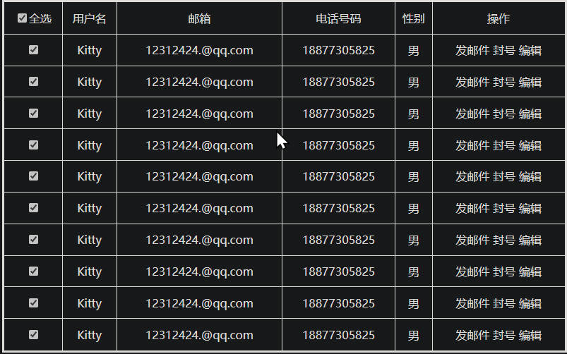
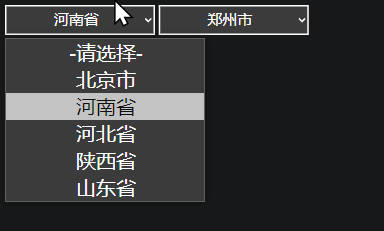
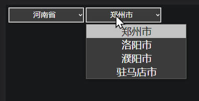

# 第八章_案例开发全功能（全选功能、二级省市联动）

## 全选功能
### html 结构
``` html
<style>
    table {
        margin: 0 auto;
        width: 800px;
        height: 500px;
        border: 3px solid;
        text-align: center;
        border-collapse: collapse;
    }

    tr>td {
        border: solid 1px;
    }
</style>
<table>
     <tr>
        <!-- 标题 -->
        <td>
            <input type="checkbox" name="select-all" onclick="selectAll(this)">全选
        </td>
        <td>用户名</td>
        <td>邮箱</td>
        <td>电话号码</td>
        <td>性别</td>
        <td>操作</td>
    </tr>
    <!-- 内容列表 -->
    <tr>
        <td><input type="checkbox" name="choice"></td>
        <td>Kitty</td>
        <td>12312424.@qq.com</td>
        <td>18877305825</td>
        <td>男</td>
        <td>发邮件 封号 编辑</td>
    </tr>
    <tr>
        <td><input type="checkbox" name="choice"></td>
        <td>Kitty</td>
        <td>12312424.@qq.com</td>
        <td>18877305825</td>
        <td>男</td>
        <td>发邮件 封号 编辑</td>
    </tr>
    <tr>
        <td><input type="checkbox" name="choice"></td>
        <td>Kitty</td>
        <td>12312424.@qq.com</td>
        <td>18877305825</td>
        <td>男</td>
        <td>发邮件 封号 编辑</td>
    </tr>
    <!-- 可以动态的增加列表 tr > td -->
</table>
```
---
### js 代码实现
- `selectAll(choiceBtn)` 全选复选框功能
- 菜单的 `input` 绑定点击事件 `onclick="selectAll(this)"`
- 这里参数直接使用 `this` 传入，表示这个元素 `input`，这样就直接拿到这个元素
- `getElementsByName()`，通过元素的 `name` 属性获取所有的用户复选框
- 使用 `for 循环` 将每一个用户复选框的，状态统一设置
``` js
function selectAll(choiceBtn)
{
    // 获取页面所有的 input 复选框 ，通过 name 属性
    var allChecked = document.getElementsByName("choice");
    console.log("以收集到的复选框个数：" + allChecked.length);
    for (let i = 0; i < allChecked.length; i++)
    {
        allChecked[i].checked = choiceBtn.checked;
    }
}
```
### 效果图
#### 全不选中


---

#### 全选中


---
## 二级省市联动
### html 结构
``` html
<style>
    select {
        width: 200px;
        height: 40px;
        font-size: 20px;
        text-align: center;
        border: 2px solid;
    }
</style>
<!-- 省份选择 -->
<select name="" id="" onchange="proivnceChang(this)" onfocus="console.log('聚焦选择省')">
    <option value="-1">-请选择-</option>
    <option value="0">北京市</option>
    <option value="1">河南省</option>
    <option value="2">河北省</option>
    <option value="3">陕西省</option>
    <option value="4">山东省</option>
</select>

<!-- 城市选择 -->
<select id="city" onfocus="console.log('聚焦选择市')">
    <option value="-1">-请选择-</option>
</select>
```
---
### js 实现
#### 1. 使用二维数组
- 保存省份、城市数据
``` js
// 保存每个省份地区里的所有城市
var provinceArr = new Array(5);
// 第 0 个 保存 北京市 里的所有城市。（当然这里只是做个例子，不会使用全部的城市）
provinceArr[0] = new Array("北京市")

// 第 1 个 保存 河南省 里的所有城市
provinceArr[1] = new Array("郑州市", "洛阳市", "濮阳市", "驻马店市");

// 第 2 个 保存 河北省 里的所有城市
provinceArr[2] = new Array("石家庄", "唐山", "秦皇岛", "邯郸");

// 第 3 个 保存 陕西省 里的所有城市
provinceArr[3] = new Array("西安市", "宝鸡市", "延安");

// 第 4 个 保存 山东省 里的所有城市
provinceArr[4] = new Array("菏泽市", "济南市", "青岛");
```
---

#### 2. 省份切换联动功能
- 当切换省份时、会自动筛选出，当前省份地区对应的城市
- 省份选择 `select` 元素绑定 `onchange="provinceChang(this)"` 事件、数值发生改变时调用此函数，传入 `this`
- `select` 的 `value` 值其实就是 `option` 的 `value` 属性的值，所以可以当作数组下标来使用（值为数字）
- 通过动态的给 `城市` 列表（`select`），添加、删除 `option` 节点、实现二级省市联动
- 以此类推，还可以使用三维数组等，多级联动
``` js
function provinceChang(province)
{
    // 获取城市选择元素
    var city = document.getElementById("city");           
    // 设置默认值，当没有做选择时，还原默认的
    if (province.value == "-1")
    {
        city.innerHTML = '<option value="-1">-请选择-</option>';
        return;
    }
    // 声明一个新的数组，保存对应下标的所有城市
    var cityArr = provinceArr[province.value];

    // 销毁 select 里的所有 option 节点          
    city.options.length = 0;

    // 遍历出所有城市
    for (var i = 0; i < cityArr.length; i++)
    {
        // 创建 option 节点
        var cityOption = document.createElement("option");
        cityOption.innerText = cityArr[i]
        // 最后追加到 city 元素里
        city.appendChild(cityOption);
    }
}
```

---

### 效果图
#### 省份选择



---

#### 对应的城市选择



---